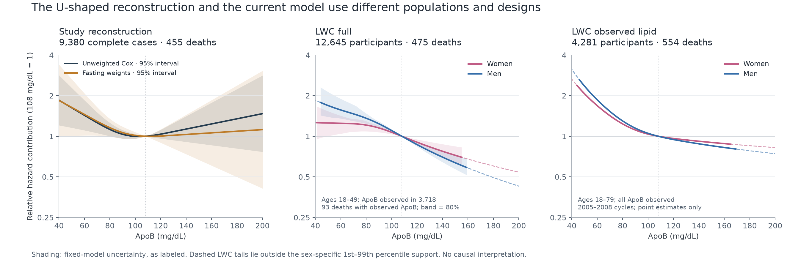
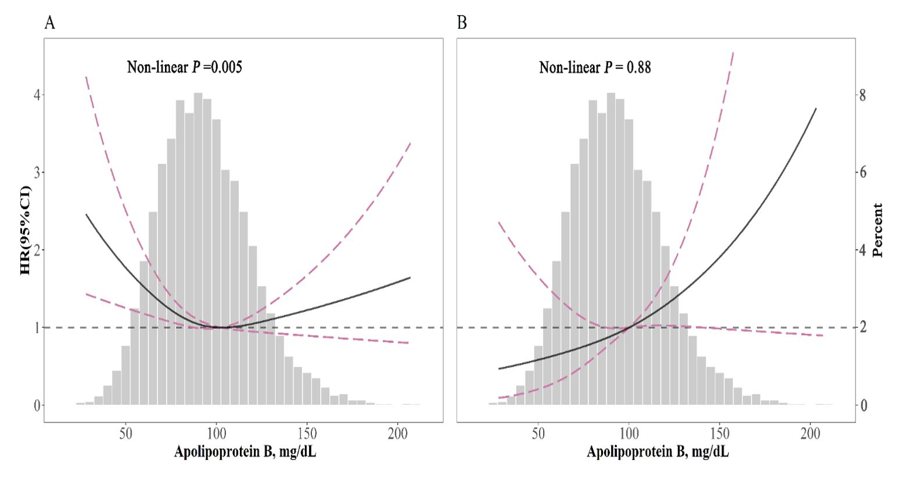
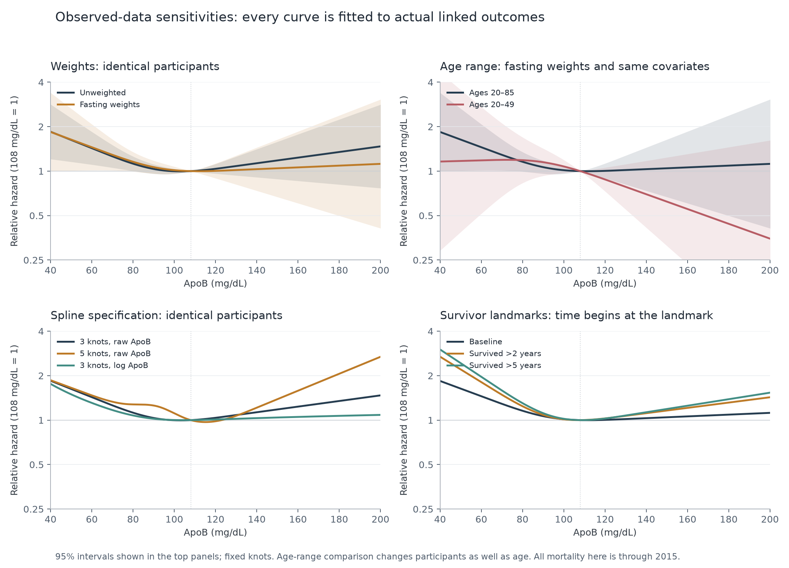
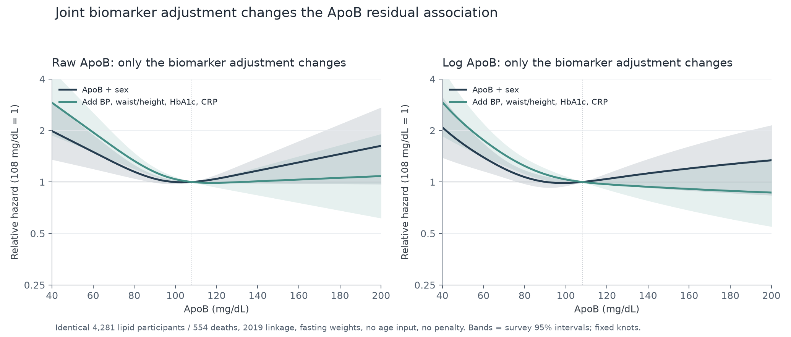
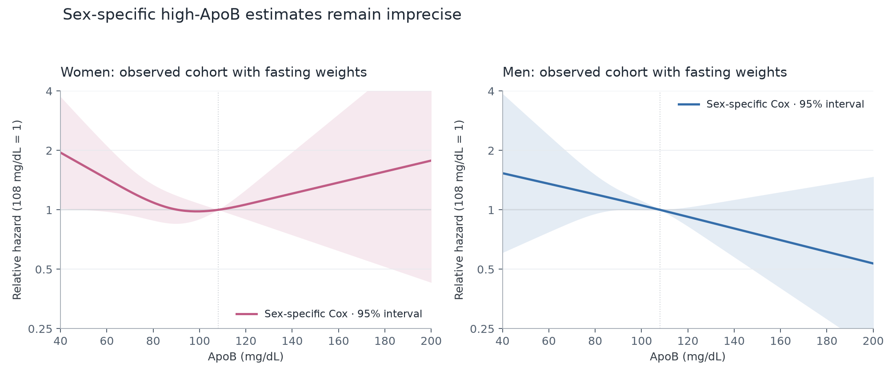

# ApoB mortality audit — 10 October 2026

The paper's cohort and U-shaped all-cause association can be reconstructed. Age range and adjustment for correlated biomarkers are leading differences from the LWC model; sample weights and spline scale also change the high-ApoB estimate. Age adjustment alone, early-death removal, the Gompertz baseline, and ridge penalties do not explain away the LWC downward component. These associations do not establish a healthy ApoB target or a causal benefit of raising ApoB.



## Cohort reconstruction and published source

The [2023 journal abstract](https://doi.org/10.1016/j.amjms.2023.07.012) states NHANES 2007–2014, n=10,375, 533 all-cause deaths, 91 cardiovascular deaths, and a 108 mg/dL turning point. The [authors' 2021 preprint, full methods, flowchart and supplements](https://www.researchsquare.com/article/rs-1039792/v1) contain the same totals. The journal full text remained inaccessible, so the detailed reconstruction is of that preprint; final-version methodological identity is unverified.

The flowchart instead reconstructs **2005–2014**: 30,295 people aged ≥18; 16,967 missing ApoB; 13 missing 2015 linkage; 2,039 cardiovascular exclusions; 901 cancer exclusions; **10,375 retained, 533 deaths, 91 cardiovascular deaths**. The retained participants are aged ≥20 because of the adult medical questionnaire. The reconstructed sex counts (4,968 men / 5,407 women), age 46.30±16.87, ApoB 93.76±25.82, smoking and education counts, and all quartile counts/deaths also match. The implied CVD mask covers coronary heart disease, angina, heart attack and stroke; it drops missing questionnaire rows but retains refused/unknown codes. Stricter masks are separate sensitivities. These many matches are strong reconstruction evidence; the authors' participant IDs were unavailable.

| Quartile (mg/dL) | Published n / deaths | Reconstructed n / deaths |
| --- | --- | --- |
| ≤76 | 2727 / 132 | 2727 / 132 |
| >76–92 | 2581 / 136 | 2581 / 136 |
| >92–110 | 2586 / 127 | 2586 / 127 |
| >110 | 2481 / 138 | 2481 / 138 |

The unweighted age/sex/race-adjusted third-vs-first-quartile HR is **0.711 (0.556–0.907)**, matching the abstract's **0.71** point estimate and closely reproducing its **0.55–0.91** interval. The preprint fully adjusted estimate is 0.73 (0.55–0.96); our complete-case implementation gives 0.743 (0.562–0.982), using 9,380 people and 455 deaths. Undocumented missing-data handling, exact eGFR/education coding, tie method and spline knots prevent claiming exact reproduction of every final coefficient. Three/four/five-knot raw-ApoB fits give minima of 103/110/115 mg/dL; no nadir was imposed.

The original figure below is Yan and colleagues' Figure 2 from [U-shaped Association Between Apolipoprotein B and All-Cause Mortality](https://www.researchsquare.com/article/rs-1039792/v1), 2021, licensed [CC BY 4.0](https://creativecommons.org/licenses/by/4.0/), reproduced unchanged. It is not a digitized or reconstructed numerical curve.



## Controlled differences

On identical 9,380 complete cases, changing unweighted Cox to CDC fasting weights moves HR(160 vs 108) from **1.23 (0.86–1.77)** to **1.06 (0.61–1.85)**. MEC weights are a diagnostic only; [CDC specifies the fasting-subsample weights for ApoB](https://wwwn.cdc.gov/Nchs/Data/Nhanes/Public/2013/DataFiles/APOB_H.htm). The correct weights retain a shallow U-shaped point estimate with weak high-tail evidence.

With the same covariates, fasting weights and 2015 mortality, restricting to ages 18–49 leaves **5,529 complete cases / 78 deaths** and HR(160 vs 108) **0.55 (0.23–1.31)**. Including ages 18–79 gives 9,047 / 319 and **1.22 (0.65–2.27)**. This changes the participant population as well as age; it is strong evidence that the young cohort can produce the reversal, not proof of a causal age interaction.

Changing raw ApoB to log ApoB on the same complete cases reduces the unweighted high-tail HR(200 vs 108) from **1.47 (0.77–2.82)** to **1.08 (0.67–1.76)**. Additional knots strengthen the raw-scale upturn but widen its interval. Calendar period, actual 2015 vs 2019 linkage, interview vs examination time origin, medication adjustment, exclusion of lipid treatment, CVD/cancer inclusion and correlated core biomarkers are all reported below, including weak/null estimates.



Holding the exact 4,281 lipid-panel participants, fasting weights, 2019 linkage, no age input and no penalty fixed, the **log-ApoB + sex** fit gives HR(125 vs 85) **1.033 (0.859–1.242)** and HR(160 vs 108) **1.199 (0.890–1.615)**. Adding only SBP, DBP, waist/height, HbA1c and CRP changes these to **0.823 (0.682–0.994)** and **0.910 (0.682–1.215)**. With raw ApoB, the same adjustment weakens the high tail from **1.301 (0.977–1.732)** to **1.033 (0.755–1.413)**. Transformation, adjustment and penalty are separate rows below. A joint model's ApoB component is a residual association conditional on the other biomarkers; it does not represent the total biological effect of ApoB.



The frozen public model is **mortality-age-0.2-9cbd69d1609e**, SHA256 `c289c1d135d6b132c84e1736b57aa434a61519cf2c94c673f3a4c7ba55da9dc2`. The full risk model uses no chronological age, ages 18–49, survey weights, a sex-specific Gompertz baseline, log ApoB, restricted cubic biomarker terms and penalized sex-specific slopes. Its 12,645 participants have 475 deaths, but only **3,718 participants / 93 deaths** have measured ApoB. It integrates missing measurements over fitted distributions. ApoB/cystatin and ApoB/VO2 have zero jointly measured participants; unknown residual correlations are assumptions. Its observed lipid panel has **4,281 / 554**, ages 18–79, ApoB+CRP from 2005–2008 development cycles, and does not integrate missing ApoB. The fact that this observed panel also slopes down means integration alone cannot explain the result.

On the exact lipid participants and original biomarker/sex spline basis, replacing Gompertz with weighted Cox still slopes down. With smooth terms and no ridge, HR(125 vs 85) is **0.840 (0.616–1.144)** in women and **0.758 (0.595–0.965)** in men. The original Gompertz smooth fit is 0.814 / 0.763; adding sex-specific age slopes gives **0.852 / 0.822**. Penalties from 0 to 0.003 and linear/smooth forms do not restore a high-ApoB upturn. Cox intervals are conditional on fixed knots and penalty selection; penalized intervals do not remove shrinkage bias. Gompertz sensitivities are point estimates only.

The original saved full-model fits also vary the assumed unobserved residual correlations and double integration draws. The table reuses those converged reference fits; it does not treat integration draws as independent people. Correlation scenarios may be shrunk to a positive-definite covariance matrix. None of these tested scenarios restores the upturn, but unknown biomarker relationships and absent joint validation remain material limitations.

| Saved full-model integration sensitivity | Women HR 125 vs 85 | Men HR 125 vs 85 | Converged |
| --- | --- | --- | --- |
| 32 draws, fitted/zero unknown covariance | 0.732 | 0.630 | True |
| Requested unknown correlation -0.3 | 0.800 | 0.726 | True |
| Requested unknown correlation +0.3 | 0.644 | 0.539 | True |
| Requested unknown correlation +0.6 | 0.707 | 0.584 | True |
| 64 draws, fitted/zero unknown covariance | 0.740 | 0.631 | True |

## Survivor landmarks and sex support

Every landmark keeps `follow-up > L`, starts time at `follow-up − L`, and counts only subsequent deaths. A participant censored at or before L is excluded. LWC full HR(125 vs 85), women/men: baseline 0.732/0.630; one year 0.714/0.623; two years 0.678/0.581; five years 0.767/0.667. The 2015 reconstructed weighted cohort retains shallow U-shaped point estimates after all three landmarks, but high-tail intervals widen. The five-year landmark also changes represented NHANES cycles because recent participants have insufficient follow-up. Landmark selection and baseline biomarker aging remain limitations.

| Sex | Cohort | n with ApoB ≥160 | Deaths | CVD deaths |
| --- | --- | --- | --- | --- |
| Women | Reconstructed 2015 | 73 | 5 | 1 |
| Men | Reconstructed 2015 | 60 | 3 | 2 |
| Women | Full, measured ApoB | 14 | 0 | 0 |
| Men | Full, measured ApoB | 18 | 1 | 1 |
| Women | Observed lipid | 30 | 6 | 1 |
| Men | Observed lipid | 37 | 10 | 5 |

In the 2015 weighted complete-case fits, HR(160 vs 108) is **1.37 (0.62–3.05)** for women and **0.70 (0.40–1.23)** for men. Opposite point estimates with these intervals do not establish a sex interaction. The full model's existing 32-replicate fixed-nuisance bootstrap gives **80%**, not 95%, intervals for HR(125 vs 85): women **0.664–0.858**, men **0.574–0.721**. It holds model selection, spline/distribution fitting and the risk-age ruler fixed, so it understates total model-development uncertainty.



## Demonstrated preparation bug

The source preparation code pooled raw 2005–2006 BN100 ApoB with later BN ProSpec results. [CDC's paired-assay Deming equation is `ProSpec = 0.923 × BN100`](https://wwwn.cdc.gov/Nchs/Data/Nhanes/Public/2007/DataFiles/APOB_E.htm). `assays.py` now applies that conversion once to raw mg/dL measurements; `prepare.py` preserves `apob_raw`, uses the calibrated value, and writes the assay provenance. The correction keeps the full and observed lipid components downward; lipid HR(125 vs 85) changes from 0.814/0.763 to **0.864/0.808**, with its curves refitted. It is a real input-preparation fix, not a way to force a U.

The public calculator and exported model have not been replaced. A defensible age-free replacement requires a new frozen development plan, correct assay inputs, survey-aware uncertainty and independent validation; this age-adjusted reproduction is a diagnostic.

## Reproduce

Install `requirements.txt` in a virtual environment. From the repository root:

```powershell
python LongevityWorldCup.Research/MortalityAge/prepare.py
python LongevityWorldCup.Research/MortalityAge/apob_inputs.py --cache .artifacts/mortality-age --output .artifacts/apob-audit
python LongevityWorldCup.Research/MortalityAge/apob_audit.py --cache .artifacts/mortality-age --output .artifacts/apob-audit --phase all
python LongevityWorldCup.Research/MortalityAge/apob_report.py --output .artifacts/apob-audit
python -m unittest discover -s LongevityWorldCup.Research/MortalityAge -p "test_*.py"
```

`apob-reference.json` preserves aggregate frozen parameters/distributions/configuration so a fresh preparation run can replay the historical public fit. The audit explicitly uses raw ApoB for that replay, then separately applies the calibration. Inputs use CDC transport files and actual archived CDC 2015 mortality files; file-type checks, respondent-key joins and SHA256 manifests verify completion. Raw participant rows and participant-key manifests remain under ignored `.artifacts`; committed results contain aggregates only. The custom Breslow implementation is checked against explicit weighted risk sets, finite-difference gradient/Hessian, score sums and an independent lifelines fit; landmark and assay tests also pass. This audit is exploratory reuse of NHANES, not new external validation.

## All observed-data specifications

The displayed minimum is within 35–210 mg/dL; an endpoint minimum indicates a downward/upward boundary, not a discovered physiological optimum. Exposure grids beyond measured support are extrapolations. The 2015 and 2019 outcomes are separate linkage versions; no artificial truncation of 2019 follow-up stands in for the 2015 files. Ordinary Cox intervals are model-based; weighted intervals use strata/PSU sandwich variance, fixed knots and survey t degrees of freedom. Cardiovascular fits censor other-cause deaths and are cause-specific hazards.

| Specification | n | Events | Weights | Grid minimum | HR 125 vs 85 (95%) | HR 160 vs 108 (95%) |
| --- | --- | --- | --- | --- | --- | --- |
| reconstructed-unadjusted | 10375 | 533 | none | 104.0 | 0.99 (0.86–1.15) | 1.07 (0.80–1.44) |
| reconstructed-demographic | 10375 | 533 | none | 103.0 | 0.98 (0.85–1.14) | 1.32 (0.98–1.78) |
| reconstructed-paper3 | 9380 | 455 | none | 103.0 | 0.99 (0.82–1.18) | 1.23 (0.86–1.77) |
| literal-2007-2014-paper3 | 7741 | 323 | none | 97.0 | 1.06 (0.84–1.34) | 1.27 (0.82–1.98) |
| reconstructed-paper3-4knots | 9380 | 455 | none | 110.0 | 0.86 (0.68–1.09) | 1.51 (0.99–2.30) |
| reconstructed-paper3-5knots | 9380 | 455 | none | 115.0 | 0.80 (0.61–1.05) | 1.58 (1.05–2.39) |
| reconstructed-paper3-log | 9380 | 455 | none | 105.0 | 0.97 (0.79–1.20) | 1.05 (0.78–1.43) |
| reconstructed-paper3-age-spline | 9380 | 455 | none | 100.0 | 1.04 (0.87–1.24) | 1.31 (0.92–1.88) |
| quartiles-none | 10375 | 533 | none | 93.0 | 0.93 (0.73–1.17) | 1.06 (0.83–1.35) |
| quartiles-demographic | 10375 | 533 | none | 93.0 | 0.92 (0.72–1.16) | 1.13 (0.88–1.43) |
| quartiles-full | 9380 | 455 | none | 93.0 | 0.82 (0.63–1.07) | 1.16 (0.89–1.51) |
| reconstructed-cardiovascular | 9380 | 79 | none | 35.0 | 1.57 (1.07–2.31) | 1.76 (0.82–3.77) |
| same-participants-weight-none | 9380 | 455 | none | 103.0 | 0.99 (0.82–1.18) | 1.23 (0.86–1.77) |
| same-participants-weight-WTMEC2YR | 9380 | 455 | WTMEC2YR | 121.0 | 0.89 (0.69–1.14) | 1.00 (0.58–1.73) |
| same-participants-weight-WTSAF2YR | 9380 | 455 | WTSAF2YR | 112.0 | 0.91 (0.70–1.19) | 1.06 (0.61–1.85) |
| same-participants-no-age | 9380 | 455 | WTSAF2YR | 120.0 | 0.96 (0.74–1.25) | 1.00 (0.58–1.72) |
| age18-49-paper3 | 5529 | 78 | WTSAF2YR | 210.0 | 0.71 (0.43–1.16) | 0.55 (0.23–1.31) |
| age18-79-paper3 | 9047 | 319 | WTSAF2YR | 101.0 | 1.02 (0.77–1.36) | 1.22 (0.65–2.27) |
| age20-85-paper3 | 9380 | 455 | WTSAF2YR | 112.0 | 0.91 (0.70–1.19) | 1.06 (0.61–1.85) |
| exam-origin-paper3 | 9379 | 454 | none | 103.0 | 0.99 (0.83–1.19) | 1.24 (0.86–1.78) |
| all-illness-included-paper3 | 11269 | 838 | WTSAF2YR | 100.0 | 1.05 (0.89–1.23) | 1.41 (1.01–1.95) |
| same-illness-cohort-unadjusted-status | 11269 | 838 | WTSAF2YR | 100.0 | 1.05 (0.89–1.23) | 1.41 (1.01–1.95) |
| same-illness-cohort-adjusted-status | 11269 | 838 | WTSAF2YR | 99.0 | 1.07 (0.90–1.26) | 1.40 (1.01–1.94) |
| same-illness-cohort-adjusted-statin | 11269 | 838 | WTSAF2YR | 101.0 | 1.02 (0.86–1.20) | 1.33 (0.95–1.87) |
| no-lipid-treatment | 7914 | 319 | WTSAF2YR | 103.0 | 0.99 (0.72–1.35) | 1.30 (0.69–2.45) |
| strict-cvd-codes | 9342 | 447 | WTSAF2YR | 109.0 | 0.93 (0.72–1.20) | 1.09 (0.63–1.90) |
| strict-five-cvd-conditions | 9253 | 430 | WTSAF2YR | 109.0 | 0.95 (0.72–1.26) | 1.06 (0.58–1.94) |
| paper3-no-med-adjustment-same-cases | 9380 | 455 | WTSAF2YR | 106.0 | 0.96 (0.75–1.23) | 1.15 (0.67–2.00) |
| corrected-assay-paper3 | 9380 | 455 | none | 100.0 | 1.04 (0.85–1.26) | 1.33 (0.91–1.94) |
| same-cohort-linkage2019 | 9380 | 788 | none | 102.0 | 1.01 (0.88–1.15) | 1.23 (0.94–1.62) |
| same-cohort-linkage2019-weighted | 9380 | 788 | WTSAF2YR | 107.0 | 0.94 (0.80–1.11) | 1.14 (0.80–1.63) |
| sex-0-paper3 | 4843 | 201 | WTSAF2YR | 99.0 | 1.06 (0.70–1.61) | 1.37 (0.62–3.05) |
| sex-1-paper3 | 4537 | 254 | WTSAF2YR | 210.0 | 0.77 (0.59–1.00) | 0.70 (0.40–1.23) |
| landmark2015-1 | 9319 | 402 | WTSAF2YR | 108.0 | 0.91 (0.68–1.22) | 1.19 (0.65–2.16) |
| landmark2019-1 | 9332 | 740 | WTSAF2YR | 106.0 | 0.94 (0.79–1.12) | 1.22 (0.85–1.74) |
| landmark2015-2 | 8338 | 342 | WTSAF2YR | 107.0 | 0.91 (0.66–1.26) | 1.21 (0.65–2.25) |
| landmark2019-2 | 9273 | 681 | WTSAF2YR | 107.0 | 0.92 (0.76–1.10) | 1.19 (0.84–1.70) |
| landmark2015-5 | 5501 | 156 | WTSAF2YR | 109.0 | 0.88 (0.56–1.36) | 1.25 (0.48–3.24) |
| landmark2019-5 | 9044 | 461 | WTSAF2YR | 106.0 | 0.95 (0.77–1.16) | 1.21 (0.80–1.83) |
| correlated-common-paper3 | 5616 | 576 | WTSAF2YR | 110.0 | 0.89 (0.73–1.09) | 1.15 (0.76–1.74) |
| correlated-common-plus-core | 5616 | 576 | WTSAF2YR | 111.0 | 0.88 (0.73–1.06) | 1.15 (0.76–1.74) |
| correlated-common-plus-core-no-age | 5616 | 576 | WTSAF2YR | 115.0 | 0.91 (0.77–1.07) | 1.04 (0.68–1.57) |
| lwc-lipid-same-cohort-single-marker | 4281 | 554 | WTSAF2YR | 104.0 | 0.98 (0.87–1.11) | 1.30 (0.98–1.73) |
| lwc-lipid-same-cohort-conditional | 4281 | 554 | WTSAF2YR | 210.0 | 0.81 (0.67–0.97) | 0.88 (0.67–1.15) |
| full-measured-apob-single-marker | 3718 | 93 | WTSAF2YR | 210.0 | 0.86 (0.49–1.51) | 0.81 (0.37–1.75) |
| full-measured-apob-core | 3718 | 93 | WTSAF2YR | 210.0 | 0.59 (0.33–1.06) | 0.53 (0.24–1.15) |
| full-measured-apob-core-age | 3718 | 93 | WTSAF2YR | 210.0 | 0.54 (0.30–0.97) | 0.49 (0.23–1.07) |
| lwc-lipid-same-cohort-single-marker-log | 4281 | 554 | WTSAF2YR | 98.0 | 1.03 (0.86–1.24) | 1.20 (0.89–1.62) |
| lwc-lipid-same-cohort-conditional-raw | 4281 | 554 | WTSAF2YR | 118.0 | 0.81 (0.70–0.93) | 1.03 (0.75–1.41) |
| lwc-lipid-same-cohort-conditional-log-unpenalized | 4281 | 554 | WTSAF2YR | 210.0 | 0.82 (0.68–0.99) | 0.91 (0.68–1.21) |

## All frozen-model sensitivities

| LWC specification | n | Deaths | Women HR 125 vs 85 | Men HR 125 vs 85 | Converged |
| --- | --- | --- | --- | --- | --- |
| full-public | 12645 | 475 | 0.732 | 0.630 | True |
| full-landmark-1 | 12632 | 462 | 0.714 | 0.623 | True |
| full-landmark-2 | 12605 | 435 | 0.678 | 0.581 | True |
| full-landmark-5 | 12528 | 358 | 0.767 | 0.667 | True |
| full-corrected-assay | 12645 | 475 | 0.713 | 0.615 | True |
| full-five-year-censored | 12645 | 117 | 0.705 | 0.676 | True |
| lipid-public | 4281 | 554 | 0.814 | 0.763 | True |
| lipid-landmark-1 | 4251 | 524 | 0.792 | 0.749 | True |
| lipid-landmark-2 | 4217 | 490 | 0.798 | 0.749 | True |
| lipid-landmark-5 | 4116 | 389 | 0.757 | 0.760 | True |
| lipid-corrected-assay | 4281 | 554 | 0.864 | 0.808 | True |
| lipid-five-year-censored | 4281 | 165 | 0.924 | 0.796 | True |
| lipid-age-adjusted | 4281 | 554 | 0.852 | 0.822 | True |
| lipid-age18-49 | 2427 | 70 | 0.807 | 0.589 | True |
| strength-public | 2045 | 143 | 0.895 | 0.731 | True |
| strength-landmark-1 | 2034 | 132 | 0.858 | 0.691 | True |
| strength-landmark-2 | 2028 | 126 | 0.781 | 0.616 | True |
| strength-landmark-5 | 1977 | 75 | 0.712 | 0.737 | True |

## Identical-cohort baseline and penalty comparisons

| Same 4,281 lipid participants | Women HR 125 vs 85 | Men HR 125 vs 85 |
| --- | --- | --- |
| cox-original-basis-smoothFalse-ridge0.0 | 0.77 (0.58–1.01) | 0.69 (0.55–0.87) |
| cox-original-basis-smoothFalse-ridge0.0003 | 0.76 (0.59–0.99) | 0.69 (0.56–0.87) |
| cox-original-basis-smoothFalse-ridge0.001 | 0.75 (0.60–0.95) | 0.70 (0.58–0.86) |
| cox-original-basis-smoothFalse-ridge0.003 | 0.75 (0.62–0.90) | 0.72 (0.60–0.85) |
| gompertz-original-basis-smoothFalse-ridge0.0 | 0.759 | 0.690 |
| gompertz-original-basis-smoothFalse-ridge0.0003 | 0.754 | 0.695 |
| gompertz-original-basis-smoothFalse-ridge0.001 | 0.747 | 0.703 |
| gompertz-original-basis-smoothFalse-ridge0.003 | 0.741 | 0.716 |
| cox-original-basis-smoothTrue-ridge0.0 | 0.84 (0.62–1.14) | 0.76 (0.59–0.96) |
| cox-original-basis-smoothTrue-ridge0.0003 | 0.83 (0.62–1.12) | 0.76 (0.60–0.96) |
| cox-original-basis-smoothTrue-ridge0.001 | 0.82 (0.63–1.07) | 0.76 (0.62–0.95) |
| cox-original-basis-smoothTrue-ridge0.003 | 0.79 (0.64–0.99) | 0.76 (0.63–0.93) |
| gompertz-original-basis-smoothTrue-ridge0.0 | 0.831 | 0.757 |
| gompertz-original-basis-smoothTrue-ridge0.0003 | 0.827 | 0.760 |
| gompertz-original-basis-smoothTrue-ridge0.001 | 0.814 | 0.763 |
| gompertz-original-basis-smoothTrue-ridge0.003 | 0.791 | 0.763 |
